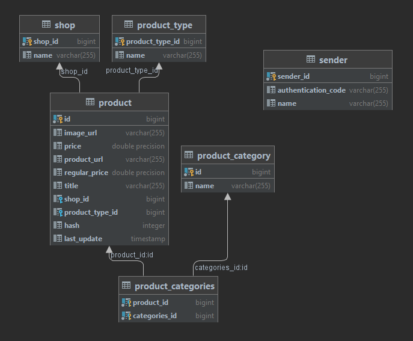

# Clothes Database Microservice

Project is a microservice, which is part of [Cheaclo](https://github.com/cheaclo/about) project. The application is a layer supporting communication between clothes database and other microservices.

## Tech stack

`java 16`

`spring-boot 2.5.2`

`postgresql`

## Details

### Database schema

### Saving data

Database is implemented on PostgreSQL relational database system. Currently, data is stored on local machine, but after deployment it will be moved to cloud.
Clothes database is linked with [Web scrapper](https://github.com/cheaclo/web-scrapper), which provides data for database. For this purpose `/clothes/product/save` entry point is implemented. First data supplier, which send post request is checked through the improvised authentication proccess. The next step is data validation. After that new products are inserted to the database. If some product already exists it's `last_update` column is update and no more actions are taken. In the end Clothes Database service delete all expired products, checking by `Last update` column. [Web scrapper](https://github.com/cheaclo/web-scrapper) is provided by message about success of inserting data.

### Distributing data

Also, API for [Client front](https://github.com/cheaclo/client-front) is provided:

`[GET] /clothes/shop/all` - returns all available shops

`[GET] /clothes/shop/match?value` - returns all shops, which names starts with value passed in the parameter

`[GET] /clothes/category/by-type?type"` - returns category names, which products exist in given type as parameter

`[GET] /clothes/category/by-shop?shopName"` - returns category names, which products exist in given shop as parameter

`[GET] /clothes/product/ids?ids"` - returns products, which match the ids passed in the parameter

`[GET] /clothes/product/match?value&shops"` - returns products, which match passed value and which are in passed shops

`[GET] /clothes/product/match/five?value&shops"` - same as above, but returns first five products

`[GET] /clothes/product/by-type?type"` - returns products, which type match type passed in the parameter

`[GET] /clothes/product/by-type-and-category?type&category"` - returns products, which type and category match values passed in the parameter

`[GET] /clothes/product/by-shop?shopName"` - returns products, which shop match shop passed in the parameter

`[GET] /clothes/product/by-shop-type-and-category?shopName&type&category"` - returns products, which shop name, type and category match values passed in the parameter
